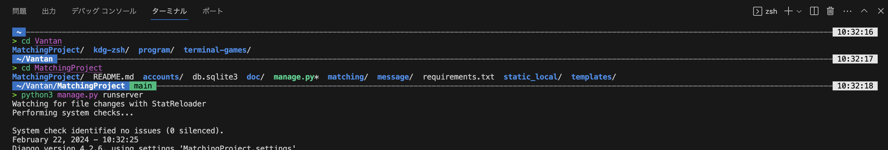
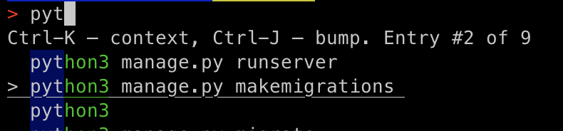
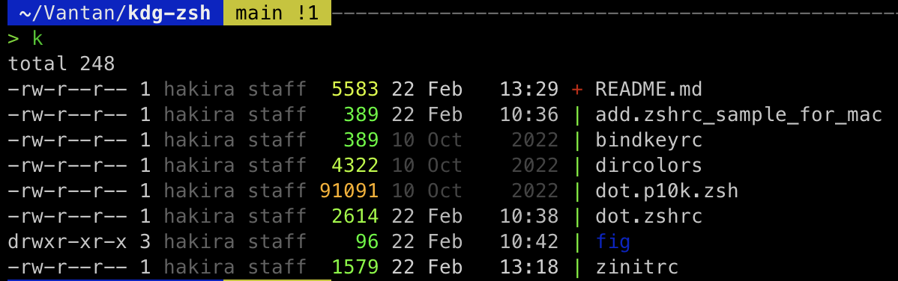

# zsh

zsh（ズィーシェル）とはシェルの一種であり，その中でも最強と言われている．
Macでは2019年以降デフォルトになっている．
未設定のzshは色分けも特に無くどこが最強なのか理解に苦しむだろうが，
適切な設定をすることで上記画像のようにカラフルで
補完機能も強くなる．
本リポジトリは上記画像のようにするための設定ファイルを配布するものである．
## Setting
### Macの場合の準備
Macの場合はhomebrewでcoreutils
を入れてあることが前提（`git clone`に必要なのと，`ls`時の色を明るくするにも必要）
であるのでまずはそこから．homebrewがインストールされていない場合は

https://brew.sh/ja/

このサイトにあるコマンドをターミナルに貼り付けて実行すればok．
少し時間がかかる．
実行後パスを通すように英語で指示されるが，
後述の[add.zshrc_sample_for_mac](add.zshrc_sample_for_mac)を用いる場合は
記述済みであるので不要．
その場合は順番前後する（全ての設定完了後になる）が，
```
brew install coreutils
```
を実行する．
### zsh
基本的にzshの設定は，`~/.zshrc`（ホームディレクトリ直下）という
ファイルに記述される．他にも`~/zshenv`や`.zprofile`といったファイルに
記述されることもあり，どのファイルに記述するかで
読み込まれる順番やタイミングが変わる．
本リポジトリではシンプルに`~/.zshrc`に集約する（他にも
ファイルはあるがそれらは`~/.zshrc`中に読み込まれる）．

まずは`clone`する．`~/.zsh`が存在しないことを確認してから行うこと
（`.`から始まるファイル，ディレクトリは隠しのため単に`ls`
では表示されず，`ls -a`とオプションが必要）．
```
cd
ls -a | grep zsh  # zshという文字列が含まれるものだけ表示
git clone git@github.com:kdg2024/kdg-zsh.git .zsh
```
その後，`.zsh`内の`dot.zshrc`を`~/.zshrc`としてシンボリックリンク
（Windowsで言えばショートカット）を貼るが，`~/.zshrc`が既に存在する場合は
置き換えると不具合が生じる可能性がある．
特に基礎クラスの1年生のプログラミングの授業を受けた人は
`django-admin`を使用するためにパスを通す記述をしているはずである．
よって，`~/.zshrc`が既に存在した場合はその内容をコピーして
`~/.zsh/add.zshrc`とする
（gitの管理下にある`~/.zsh/dot.zshrc`に追記してもいいがしたくない）．
```
mv .zshrc .zsh/add.zshrc
# mvは移動とリネームを行うコマンド
```
その後，シンボリックリンクを貼る．
```
ln -sf .zsh/dot.zshrc ~/.zshrc
```
**ここで分岐**．デザインを自分で選びたければここで
設定ファイルの再読み込み（反映）．
```
exec zsh
```
その後案内に従って選択する．
逆に，先程の画像と同じでよければ，その設定ファイル（自動生成）が
`~/.zsh/dot.p10k.zsh`であるので，
```
ln -sf ~/.zsh/dot.p10k.zsh ~/.zsh/.p10k.zsh
```
としてから
```
exec zsh
```
### 追加設定（特にMac）
gitの管理化にあるファイルに変更を加えたくないため，
マシンごとの設定は`~/.zsh/add.zshrc`に記述する．
特にMacの場合はhomebrewとcoreutilsが必要なので，
[add.zshrc_sample_for_mac](add.zshrc_sample_for_mac)
を参照して適切なものを記述（追記）する．
よくわからなければとりあえずコピーで良い．
コマンドで追記する場合は
```
cat ~/.zsh/add.zshrc_sample_for_mac >> ~/.zsh/add.zshrc
```
でok．`>>`でファイル末尾に追記され，`ファイルが存在しなければ新規作成される．  
設定に変更を加えたら反映のために再読込する．
```
exec zsh
```
## 機能
- `cd`コマンドを実行したときに自動で`ls`が実行される
- `cd`無しでもディレクトリのパスを入力すれば移動
- 補完機能においては大文字，小文字を区別しない
- `la`で`ls -a`が実行される（隠しファイルも表示）
- `ll`で`ls -l`が実行される（詳細を表示）
- `lla`で`ls -la`が実行される（`-a`と`-l`をまとめて`-la`）
- 入力中に`ctrl+r`で履歴検索
<!--  -->


- `k`で`ls`をよりカラフルかつgitの情報等を加えたものを実行できる
  - `ka`で`k -a`を実行できる（隠しファイルも表示）
<!--  -->


- gitの管理化にあるディレクトリで`git open`を実行するとブラウザが起動してgithub等のページが開く

## メモ
- プラグインの管理には[Zinit](https://github.com/zdharma-continuum/zinit)
を使用しており，それによるプラグインの読み込みは
[zinitrc](zinitrc)に集約したうえで`~/.zshrc`に読み込む．
- プラグインの中でも[Powerlebel10k](https://github.com/romkatv/powerlevel10k)
が特に中核となっている．その他はコメントアウトを参照したり
ググったりし欲しい（作った張本人もこの文章を書いている時点で
作ってから1年以上経っているためどれがどれだか覚えていない）．
- Zinitnの更新: `zinit self-update`
- プラグインの更新: `zinit update`
- Powerlebel10kの再設定: `p10k configure`
  - 最後の`zshrc`の問は`n`
- dircolorsはデフォルトからシンボリックリンクのみ31（赤）から36（シアン）に変更

